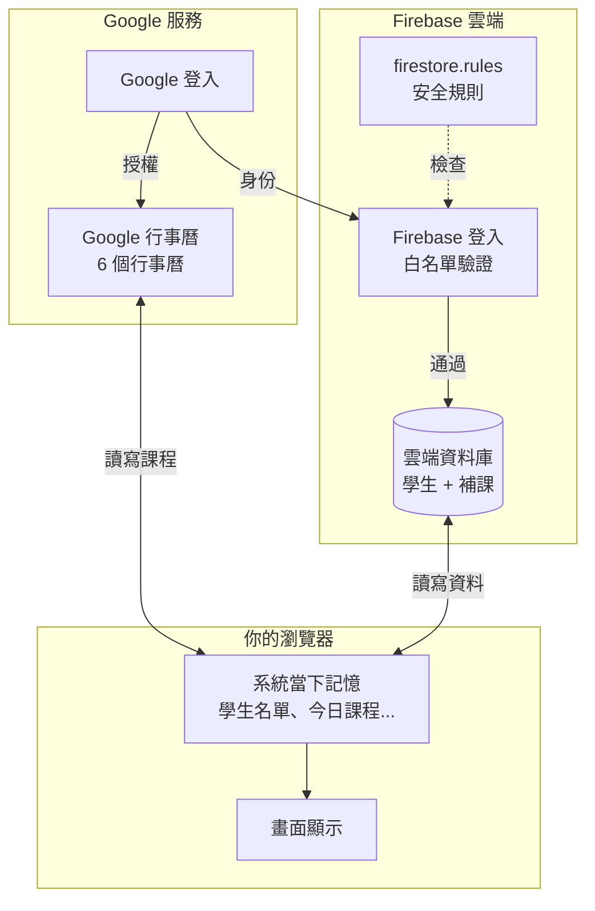
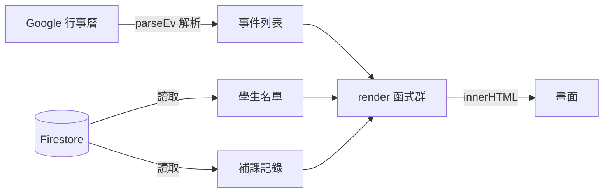
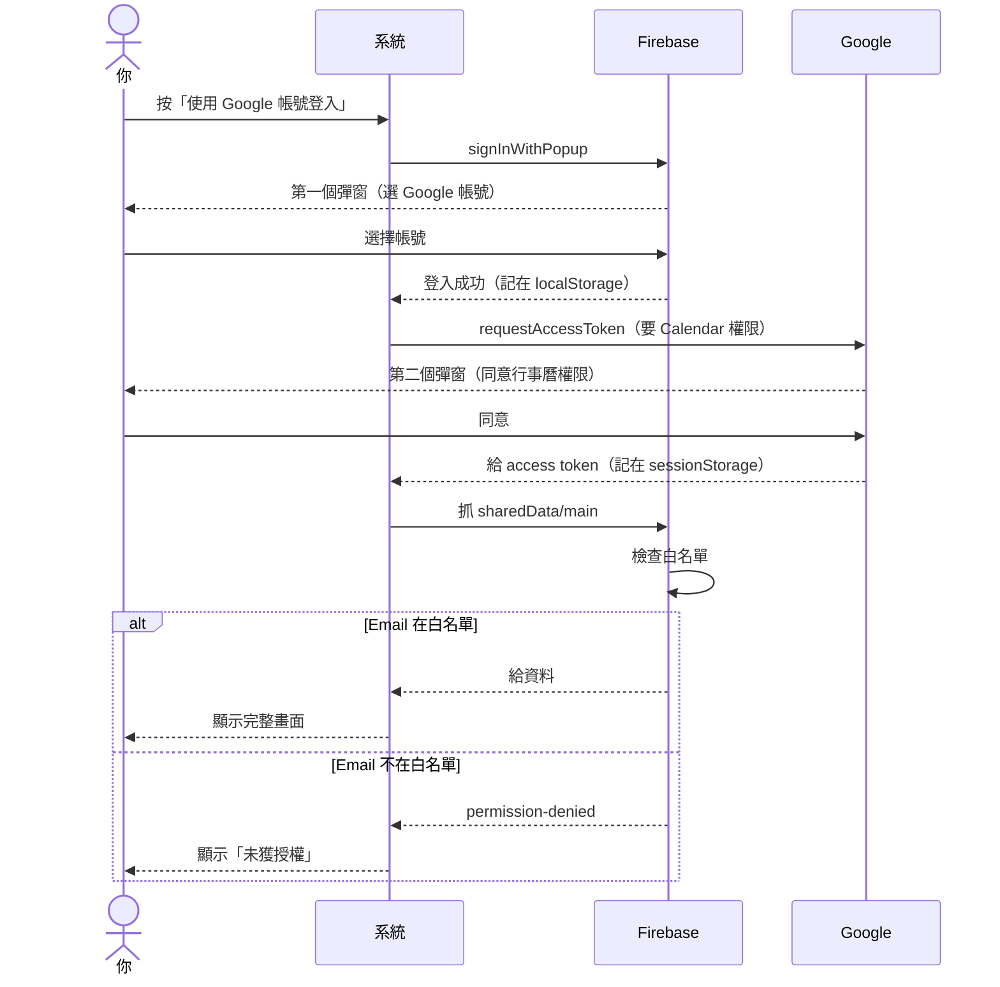
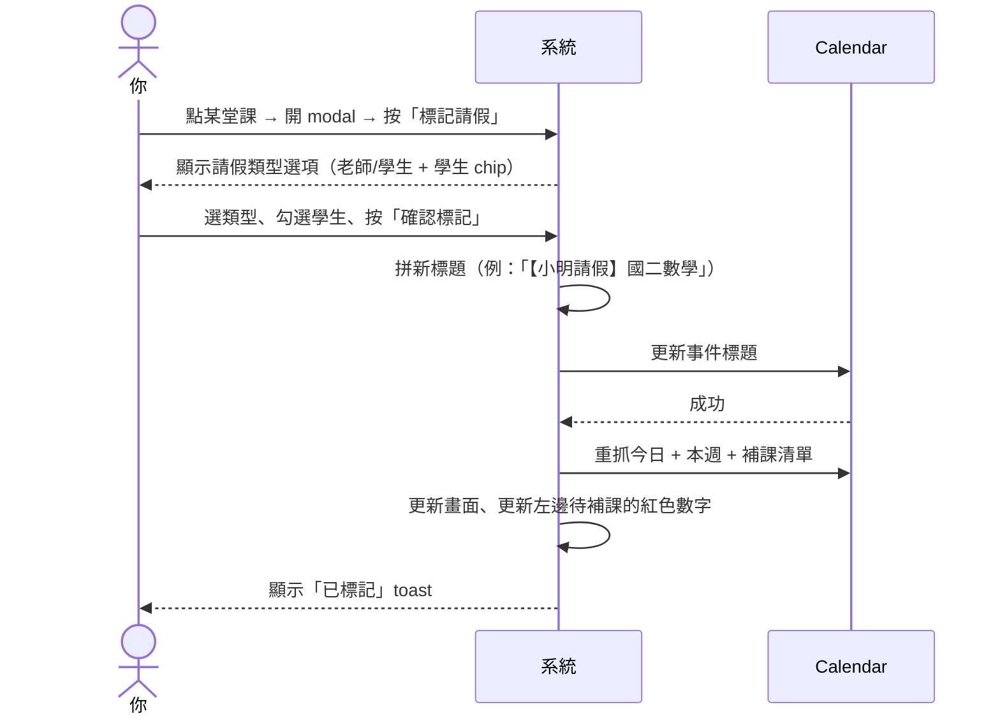
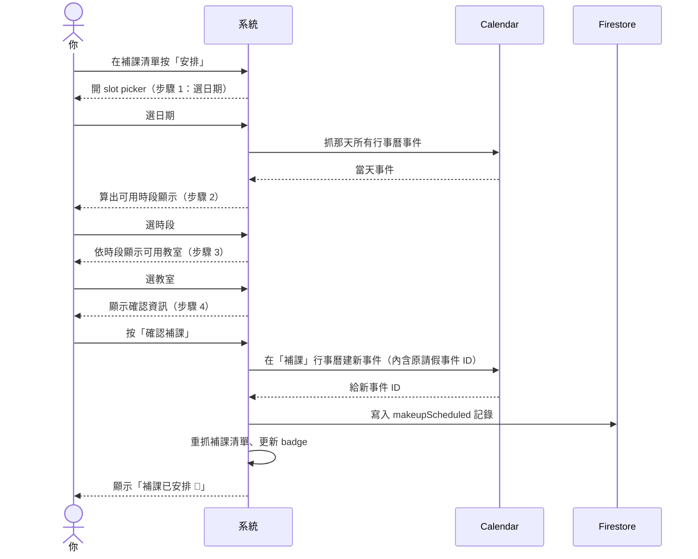
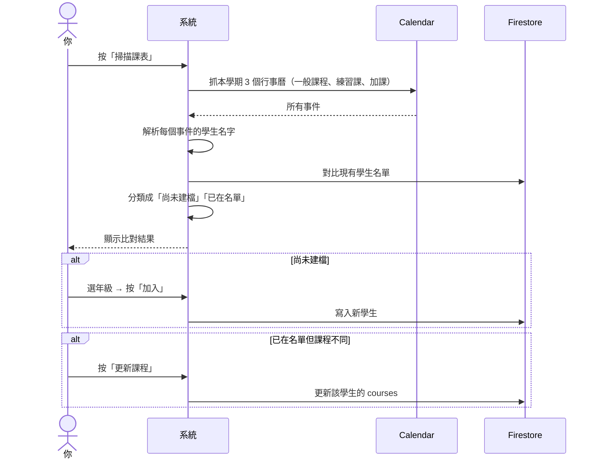
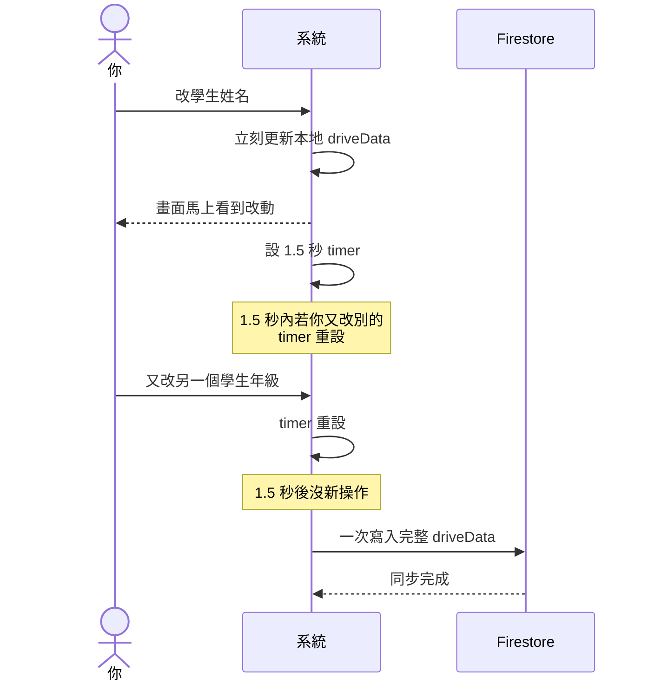

# 補習班排程系統 系統地圖

> **這份是什麼**：用白話 + 視覺圖把整個系統的結構與運作流程畫出來，讓非工程師也讀得懂
> **寫什麼**：5 個子系統的「做什麼/存什麼/什麼時候會用到/遇到狀況怎麼辦」+ 5 個關鍵流程的視覺圖
> **不寫什麼**：細節程式碼（每段最後「技術備註」才出現，給 Claude 用）
> **怎麼看圖**：Mermaid 流程圖在 VS Code（裝 Mermaid Preview 套件）或 GitHub 網頁會自動渲染成圖；純文字看不出來

---

## 一頁概覽

整個系統由 5 大塊組成，互相之間靠資料流動串起來：

**怎麼讀這張圖**：
- 你的瀏覽器放著系統當下的記憶（今天有什麼課、學生有誰）
- 它一邊跟 Google 行事曆要課程資料，一邊跟 Firebase 雲端要學生與補課資料
- 拿到資料後組合成你看到的畫面

---

## 子系統 1：登入系統

**簡單說**：用 Google 帳號通過兩道門：（1）Google 同意系統讀寫你的行事曆 （2）Firebase 確認你在白名單上才能讀寫雲端資料。

**為什麼有兩道門**：這兩件事是不同的權限，要分別取得：
- 第一道：**行事曆權限**（讓系統讀你的補習班行事曆）
- 第二道：**雲端資料權限**（讓系統讀寫學生名單與補課排程）

**你會看到什麼**：
- 第一次登入：兩個 Google 帳號選擇彈窗，依序出現
- 重新整理（cmd+R）：不用再點，系統自動還原
- 換瀏覽器或清掉資料：要重做兩道門
- 不在白名單的帳號：第二道門過得了但讀不到資料，畫面顯示「未獲授權」

**遇到狀況怎麼辦**：
- 想加新成員 → 編輯 `firestore.rules` 把 email 加進去，貼到 Firebase Console 發佈
- 想踢掉某個帳號 → 從 `firestore.rules` 移除，重新發佈
- 彈窗被瀏覽器擋 → 允許彈窗後重試

🔧 **技術備註**
- GIS token client 初始化：[app.js:61](app.js#L61)
- Firebase Google 登入：[app.js:104](app.js#L104) `ensureFirebaseAuth`
- Token 還原：[app.js:80](app.js#L80) （sessionStorage）
- Race condition 處理：[app.js:154](app.js#L154) （onAuthStateChanged）

---

## 子系統 2：行事曆

**簡單說**：系統連到你 Google 帳號裡的 **6 個行事曆**（一般課程、補課、調課、試聽、練習課、加課），讀出所有課程整理成「今日課程」「本週課程」「待補課清單」。標記請假/補課時也會寫回去。

**它讀什麼**：
- 從 6 個行事曆抓所有事件
- 解析每個事件的：課程類型（家教 / 班 / 練習）、教室、老師、學生、是否請假、是否調課

**它寫什麼**：
- 標記請假 → 改事件標題前綴（例如「【小明請假】國二數學」）
- 標記調課 → 改標題加「【調課】」
- 安排補課 → 在「補課」行事曆建新事件
- 安排調課時段 → 在「調課」行事曆建新事件
- 新增課程 → 在指定行事曆建新事件

**標題與備註的格式規則** → 詳見 [`功能說明.md`](功能說明.md)

**你會遇到什麼**：
- 系統會自動每分鐘更新「現在進行中」的時間軸標示
- Token 大約 1 小時會過期，系統會自動續約（在背景做，不會打擾你）

🔧 **技術備註**
- 讀今日：[app.js:309](app.js#L309) `loadToday`
- 讀本週：[app.js:350](app.js#L350) `loadWeek`
- 讀補課清單：[app.js:1035](app.js#L1035) `loadMakeup`
- 事件解析核心：[app.js:220](app.js#L220) `parseEv`（90 行純函式，整個系統的解析大腦）
- 寫入（標題編輯）：events.patch 在 app.js 多處
- 寫入（建新事件）：events.insert 在 app.js 多處

---

## 子系統 3：雲端資料庫（Firestore）

**簡單說**：放在 Google 雲端的小資料庫，存「學生名單」跟「補課排程」這兩份資料。所有白名單帳號登入後看到的都是同一份，A 改完 B 馬上看到。

**它存了什麼**：
- **學生名單**：每個學生的姓名、年級、上的課
- **補課排程**：誰請假、安排了什麼時候補課

**它怎麼決定誰能看**：
靠 Firebase 後台一份白名單檔案（`firestore.rules`）。目前白名單：
- william90525@gmail.com
- hobemath@gmail.com

**什麼時候會用到它**：
- 登入時 → 從雲端抓資料下來
- 新增/修改/刪除學生 → 等 1.5 秒後同步到雲端
- 按「掃描課表」更新學生課程 → 同步到雲端
- 安排或取消補課 → 同步到雲端

**遇到狀況怎麼辦**：
- 看到「此 Google 帳號未獲授權」→ 你登入的帳號不在白名單，去 Firebase 後台改 `firestore.rules`
- Console 紅字「Cross-Origin-Opener-Policy」→ 沒事，瀏覽器警告，**忽略**

🔧 **技術備註**
- 載入：[app.js:151](app.js#L151) `loadFromFirestore`
- 儲存：[app.js:168](app.js#L168) `saveToFirestore`（debounce 1.5s）
- 本地記憶：`driveData` 變數
- 白名單規則：[firestore.rules](firestore.rules) `isAllowed()`

---

## 子系統 4：畫面顯示

**簡單說**：把行事曆與雲端拿到的資料，組合成你看到的三個主畫面：**課程頁**、**待補課清單**、**學生管理**。

**主要畫面**：
- **課程頁**：教室時間軸 + 進行中 hero 卡 + 今日課程列表 + 本週課程
- **待補課清單**：待安排 / 已安排 / 已完成 三區，含搜尋與篩選
- **學生管理**：依年級分組的學生卡、欠課數、多收費警示、編輯模式

**資料怎麼變成畫面**：

**你會遇到什麼**：
- 按「更新」會重抓行事曆資料、整批重畫
- 切換日期 / 週次 / 學期會觸發對應 render
- 修改學生資料後畫面立刻反映，雲端 1.5 秒後才同步（debounce）

🔧 **技術備註**
- renderToday：[app.js:443](app.js#L443)
- renderWeek：[app.js:600](app.js#L600)
- renderMakeup：[app.js:1106](app.js#L1106)
- renderStudents：[app.js:2121](app.js#L2121)
- 課程卡 HTML：`tcardHtml`、`wcardHtml`、`mkCardHtml` 等
- 整檔有 40 處 innerHTML 寫入（見 [架構梳理.md](架構梳理.md) 第 4 點）

---

## 子系統 5：補課媒合

**簡單說**：把「某天某堂課請假/調課」跟「後來安排的補課時段」配對起來，這樣才能知道每筆請假是否已經補上、學生還欠幾堂課。

**它怎麼配對**：
1. **首選**：補課事件的「擴充屬性」裡記著原請假事件 ID（精準對應）
2. **備援**：如果沒記 ID，靠標題格式比對（如「【小明補課(...)】國二數學」對應「【小明請假】國二數學」）
3. **本地紀錄**：之前安排但沒被掃描到的補課，從本地記錄補足

**為什麼需要配對**：
- 學生**欠課數** = 請假總數 − 已補課數
- **多收費警示**要看請假次數 vs 補課狀態
- 補課清單要區分「待安排 / 已安排 / 已完成」三區

**你會遇到什麼**：
- 如果手動改了補課行事曆的事件標題，可能配對失敗 → 那筆會變回顯示「未安排」
- 取消補課 → 系統同時刪除補課行事曆事件 + 移除配對記錄

🔧 **技術備註**
- 配對主邏輯：[app.js:1055](app.js#L1055)（在 `loadMakeup` 內）
- 配對結果存在：`makeupMatchMap`（`Map<absenceEventId, scheduledInfo>`）
- 補課事件擴充屬性鍵：`extendedProperties.private.originalAbsenceId`

---

## 關鍵流程

挑 5 個「跨多個子系統 + 容易混淆」的操作畫出來。

### 流程 1：登入

**cmd+R 後為什麼不用再登入**：
- Firebase 登入存在 localStorage（瀏覽器永久記憶體），重整理不會消失
- Calendar token 存在 sessionStorage（分頁記憶體），重整理也不會消失（**但關掉分頁就消失**）
- 兩個都在 → 直接還原進入系統

---

### 流程 2：標記請假

---

### 流程 3：補課排程（slot picker 四步驟）

---

### 流程 4：學生掃描課表

---

### 流程 5：資料同步到雲端（debounce 機制）

**為什麼要 debounce**：避免你連續改 5 筆資料時打 5 次雲端，浪費頻寬也增加衝突風險。
