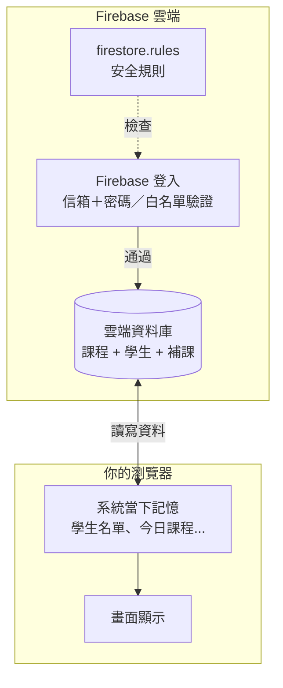
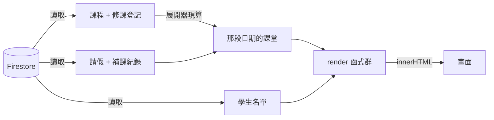
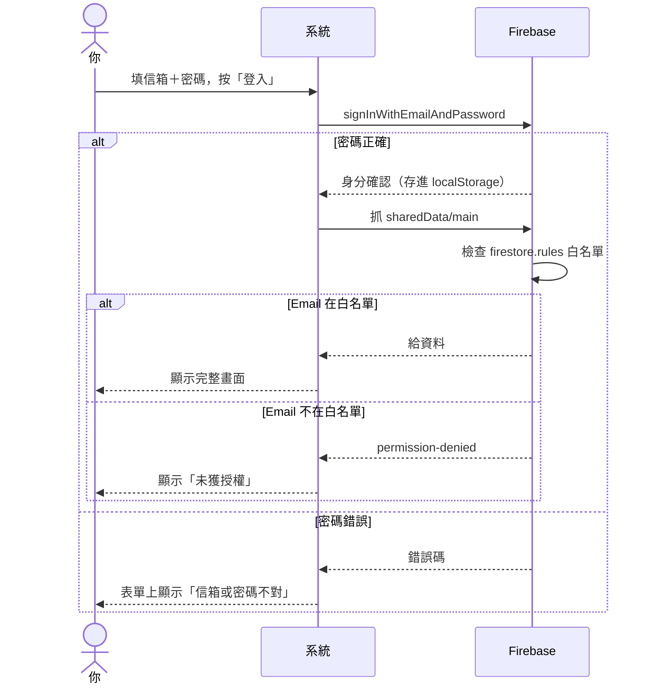
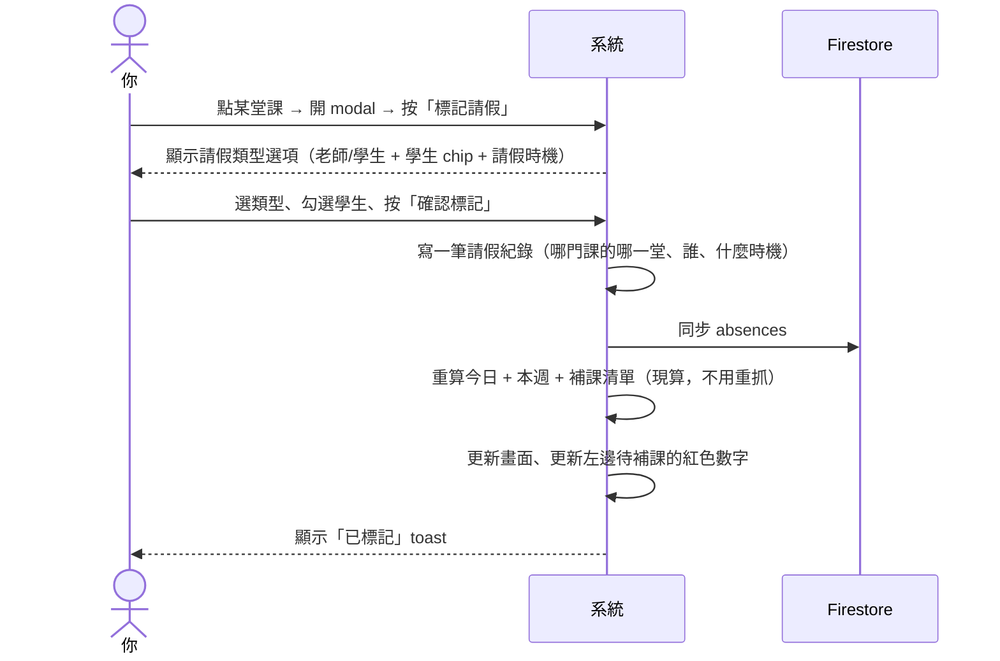
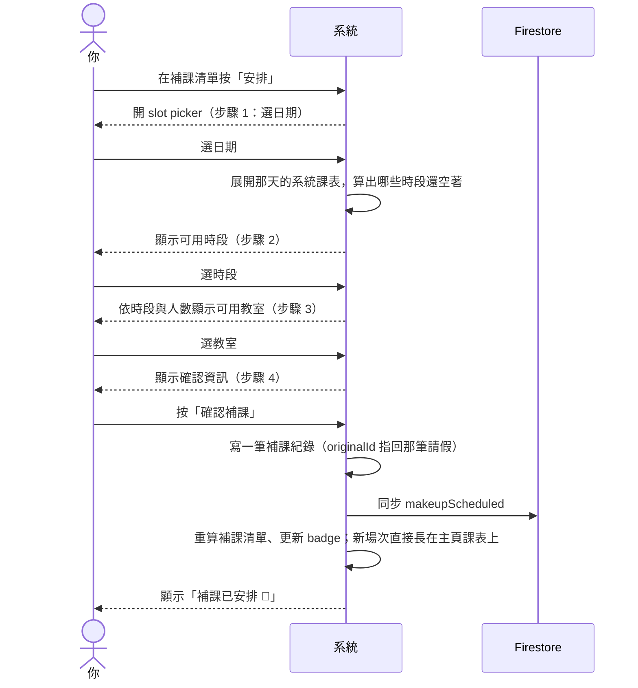
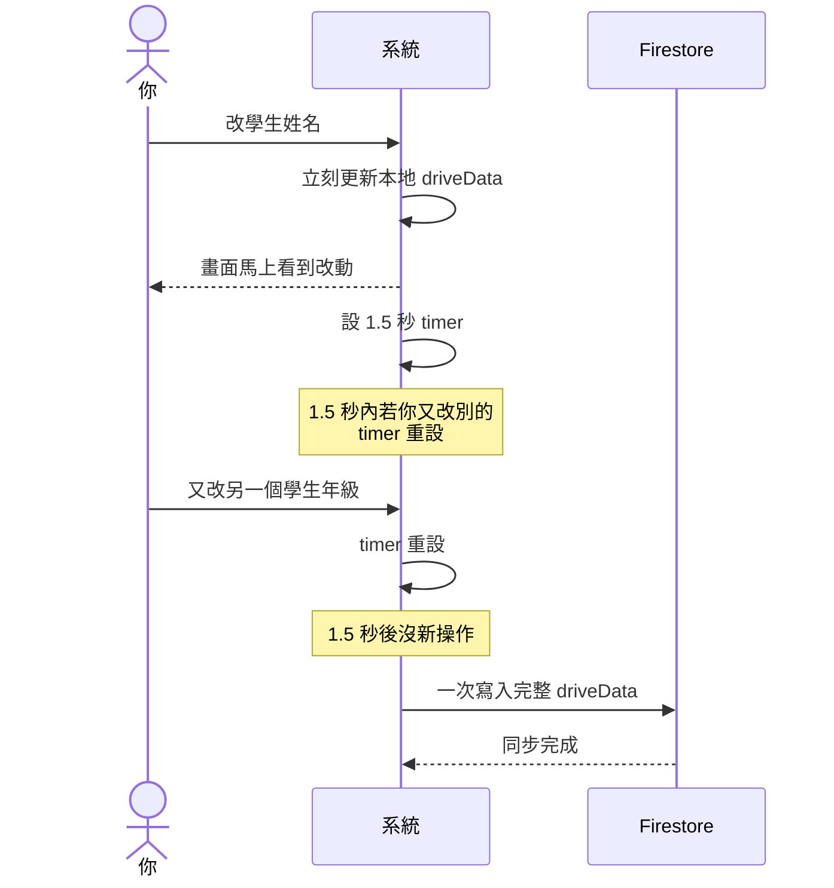

# 補習班排程系統 系統地圖

> **這份是什麼**：用白話 + 視覺圖把整個系統的結構與運作流程畫出來，讓非工程師也讀得懂
> **寫什麼**：5 個子系統的「做什麼/存什麼/什麼時候會用到/遇到狀況怎麼辦」+ 5 個關鍵流程的視覺圖
> **不寫什麼**：細節程式碼（每段最後「技術備註」才出現，給 Claude 用）
> **怎麼看圖**：Mermaid 流程圖在 VS Code（裝 Mermaid Preview 套件）或 GitHub 網頁會自動渲染成圖；純文字看不出來

---

## 一頁概覽

整個系統由 5 大塊組成，互相之間靠資料流動串起來：

```mermaid
graph TB
    subgraph browser [你的瀏覽器]
        UI["畫面顯示"]
        AppState["系統當下記憶<br>學生名單、今日課程..."]
    end

    subgraph firebase [Firebase 雲端]
        Auth["Firebase 登入<br>信箱＋密碼／白名單驗證"]
        Firestore[("雲端資料庫<br>課程 + 學生 + 補課")]
        Rules["firestore.rules<br>安全規則"]
    end

    Rules -.檢查.-> Auth
    Auth -->|通過| Firestore
    Firestore <-->|讀寫資料| AppState
    AppState --> UI
```

> **2026-07-30 起圖上沒有 Google 了**：系統不再連 Google 行事曆、也不再載入任何 Google API。課表、請假、補課全都住在 Firestore 裡，登入只是「確認你是誰」。舊的 Google 行事曆事件留在 Google 當歷史備份，系統不讀不寫。

**怎麼讀這張圖**：
- 所有資料（課程、學生、請假、補課、點名、成績）都在 Firebase 雲端那一份
- 登入通過白名單後，瀏覽器把整份抓下來放進「當下記憶」
- 課表是**現算的**：課程記的是排程規則（每週二 19:00…），要顯示哪一天就當場展開成那天的課堂
- 改了什麼先動記憶（畫面立刻變），1.5 秒後才寫回雲端

---

## 北極星：系統自己擁有課表（✅ 2026-07-30 抵達）

> **這是什麼**：往後每個架構決策的對齊基準。**這一段的目標已經達成**，留著是為了記住當初為什麼這樣選。

**最終目標**：日常營運的核心操作——管學生、管課程、管學費——**全部在系統裡完成，不需要打開 Google Calendar 操作**。例如：

- 新學生加入某堂既有的課
- 某學生某堂課不再繼續（團班退一人，課程本身照常）
- 某課程換老師、改時段或教室（課程本身延續）

要做到這個，系統內必須有一個**「課程實體」**：一筆存在 Firestore 的課程資料，擁有自己的老師 / 時間 / 教室 / 修課名單。原本的規劃是把 Google Calendar 降為「自動產生的投影」，後來（2026-06-24 老闆拍板）改成更乾脆的做法：**不做投影，直接讓行事曆退場**。

**現在走到哪（2026-07-30）**：✅ **到了**。課程本體（老師／時段／教室／單價／名單）全在 Firestore，請假、曠課、調課、補課、點名、成績也都在系統裡；主頁、桌面日曆、待補課清單、學生統計全部讀系統。Google Calendar 沒有降為投影，而是**直接退場**——舊事件留在 Google 當歷史備份，系統不讀不寫，連 Google API 都不載入了。

**接下來的北極星**：③ 學費系統、④ 老師薪資表（前置條件都已備妥），之後是角色權限分級。見 [`todos.md`](todos.md)。

---

## 子系統 1：登入系統

**簡單說**（2026-07-30 改版）：填**信箱＋密碼**登入，通過兩道門：（1）Firebase 確認密碼對不對 （2）`firestore.rules` 確認你的信箱在白名單上，才讀得到雲端資料。

**為什麼只剩身分**：以前登入還要順便跟 Google 要「讀行事曆」的權限，那個權限**每小時就過期**，是「用著用著被踢出去要重登」的元凶。系統改成自己擁有課表之後，行事曆權限整個不需要了，登入就只剩「你是誰」這一件事。

**你會看到什麼**：
- 登入頁：信箱、密碼、一顆「登入」，底下一行「第一次登入／忘記密碼？寄設定密碼信」
- **第一次用**：填信箱按那行連結 → 收信 → 點連結設密碼 → 回來登入
- 重新整理（cmd+R）、關掉再開、隔天再來：**都不用再登入**，也不會再跳任何授權視窗
- 不在白名單的帳號：登入得了但讀不到資料，畫面顯示「未獲授權」

**遇到狀況怎麼辦**：
- 想加新成員 → 見 [`新員工加入SOP.md`](新員工加入SOP.md)（建帳號＋寄重設密碼信、加白名單兩件事都要做）
- 想踢掉某個帳號 → Firebase Authentication 停用帳號 **＋** 從 `firestore.rules` 移除後重新發佈
- 忘記密碼 → 登入頁那行連結自己寄信重設

🔧 **技術備註**
- 單一進入點：[js/init.js](../js/init.js) `initAuth` → `onAuthStateChanged`（登入/登出都走這裡）
- 密碼登入與寄信：[js/init.js](../js/init.js) `signInPassword` / `sendResetMail`
- 全站「有沒有登入」判斷：[js/init.js](../js/init.js) `isSignedIn()`
- 登入狀態存在 localStorage 由 Firebase 自行續期，系統這邊沒有任何 token 管理程式碼

---

## 子系統 2：課表引擎（課程 → 課堂）

**簡單說**：課程存的是**排程規則**（例如「每週二、四 19:00–20:30，小教室，王老師」），不是一堂一堂的紀錄。要看哪一段日期，引擎就當場把規則**展開**成那幾天的課堂——今日課程、本週課程、桌面日曆的日／週／月檢視，全都是同一個引擎算出來的。

**展開時會一併算好**：
- **那天的名單**：修課登記簿裡「那天在籍」的學生（有設插班／中途退出起訖的會自動進出）
- **那天的課名**：課名分段（「8/1 起改叫…」）依日期取
- **那天的時段**：換時段分段（「開學後改時間」）依日期取
- **請假疊加**：那堂有沒有人請假／曠課／整堂調課，課堂會標記出來並變淡

**另外兩種課堂**：
- **補課／調課場次**：從補課紀錄長出來，直接排進課表，標「補課」「調課」
- **舊行事曆搬遷的請假**：自帶快照（課名／時段／名單），只出現在待補課清單與學生統計，不會在主頁長出幽靈課堂

**你會遇到什麼**：
- 改了課程的時段或名單，**所有日期的課堂立刻跟著變**（因為是現算的，沒有「已經產生的課堂」需要同步）
- 改動只影響顯示規則，過去的點名、成績、請假紀錄都是獨立存的，不會被改掉

🔧 **技術備註**
- 展開器：[js/schedule.js](../js/schedule.js) `expandCoursesForRange` / `expandMakeupForRange`
- 單門課展開：`courseOccurrencesInRange`（處理 weekly／dates 兩種模式與 phases 分段）
- 請假疊加：`_absFields`；請假紀錄 → 課堂：`sysAbsenceEvents`
- 讀今日：[js/today.js](../js/today.js) `loadToday`；讀本週：[js/week.js](../js/week.js) `loadWeek`；桌面日曆：[js/dayview.js](../js/dayview.js) `dvLoadEvents`

---

## 子系統 3：雲端資料庫（Firestore）

**簡單說**：系統的**唯一資料來源**。所有白名單帳號登入後看到的都是同一份，A 改完 B 馬上看到。

**它存了什麼**（詳細欄位見 [`資料結構.md`](資料結構.md)）：
- **課程**：老師、排程規則、教室、預設單價、需不需要登記成績
- **學生名單**：姓名、年級、學校、家長電話、狀態
- **修課登記簿**：誰修哪門課、個人單價、修課起訖
- **請假紀錄**：誰哪一堂請假／曠課／整堂調課、請假時機
- **補課排程**：安排到什麼時候、哪間教室
- **點名與成績**：按期別分開存（避免單一文件撐爆 1MB 上限）

**它怎麼決定誰能看**：
靠 Firebase 後台一份白名單檔案（`firestore.rules`）的 email 清單（以該檔實際內容為準，這裡不重複列）。
另外還要有帳號才進得來——兩件事都做完才算開通，見 [`新員工加入SOP.md`](新員工加入SOP.md)。

**什麼時候會用到它**：
- 登入時 → 從雲端抓資料下來
- 新增/修改/刪除學生 → 等 1.5 秒後同步到雲端
- 在課程視窗或學生編輯面板加退課 → 同步到雲端
- 安排或取消補課 → 同步到雲端

**遇到狀況怎麼辦**：
- 看到「此帳號未獲授權」→ 你登入的帳號不在白名單，去 Firebase 後台改 `firestore.rules`
- Console 紅字「Cross-Origin-Opener-Policy」→ 沒事，瀏覽器警告，**忽略**

🔧 **技術備註**
- 載入：[js/init.js](../js/init.js) `loadFromFirestore`
- 儲存：[js/init.js](../js/init.js) `saveToFirestore`（debounce 1.5s，由 `scheduleDriveSave` 觸發）
- 本地記憶：`driveData` 變數（宣告在 [js/state.js](../js/state.js)）
- 白名單規則：[firestore.rules](../firestore.rules) `isAllowed()`

---

## 子系統 4：畫面顯示

**簡單說**：把雲端拿到的資料（含課表引擎現算出的課堂），組合成你看到的畫面：**課程頁**、**桌面日曆**、**待補課清單**、**學生管理**、**課程管理**。

**主要畫面**：
- **課程頁**：教室時間軸 + 進行中 hero 卡 + 今日課程列表 + 本週課程
- **待補課清單**：待安排 / 已安排 / 已完成 三區，含搜尋與篩選
- **學生管理**：依年級分組的學生卡、欠課數、多收費警示、編輯模式

**資料怎麼變成畫面**：

```mermaid
graph LR
    FS[("Firestore")] -->|讀取| Courses["課程 + 修課登記"]
    FS -->|讀取| StuList["學生名單"]
    FS -->|讀取| Makeup["請假 + 補課紀錄"]
    Courses -->|展開器現算| Events["那段日期的課堂"]
    Makeup --> Events
    Events --> Render["render 函式群"]
    StuList --> Render
    Render -->|innerHTML| DOM["畫面"]
```

**你會遇到什麼**：
- 按「更新」會重抓雲端資料、整批重畫
- 切換日期 / 週次 / 學期會觸發對應 render
- 修改學生資料後畫面立刻反映，雲端 1.5 秒後才同步（debounce）

🔧 **技術備註**
- renderToday：[js/today.js](../js/today.js)
- renderWeek：[js/week.js](../js/week.js)
- renderMakeup：[js/makeup.js](../js/makeup.js)
- renderStudents：[js/students.js](../js/students.js)
- 課程卡 HTML：`tcardHtml`、`wcardHtml`、`mkCardHtml` 等
- innerHTML 寫入模式的風險：見 [archive/架構梳理.md](archive/架構梳理.md) 第 4 點

---

## 子系統 5：補課媒合

**簡單說**：把「某天某堂課請假/調課」跟「後來安排的補課時段」配對起來，這樣才知道每筆請假補上了沒、學生還欠幾堂課。

**它怎麼配對**：每筆請假紀錄有自己的 id（`occId`＝哪門課的哪一堂），補課紀錄用 `originalId` 指回去，一對一直接對上。**沒有比對標題文字這種脆弱做法**。

**為什麼需要配對**：
- 學生**欠課數** = 請假總數 − 已補課數
- **多收費警示**要看請假次數 vs 補課狀態
- 補課清單要區分「待安排 / 已安排 / 已完成」三區

**你會遇到什麼**：
- 取消安排 → 補課紀錄移除、那筆請假退回「待安排」，主頁上的補課場次一併消失
- 補課時段結束後自動移到「已完成安排」區

🔧 **技術備註**
- 清單來源：[js/makeup.js](../js/makeup.js) `loadMakeup`（`sysAbsenceEvents()` ＋ 已排補課紀錄）
- 配對結果存在：`makeupMatchMap`（`Map<occId, scheduledInfo>`）
- 請假紀錄結構見 [`資料結構.md`](資料結構.md)

---

## 關鍵流程

挑 5 個「跨多個子系統 + 容易混淆」的操作畫出來。

### 流程 1：登入

```mermaid
sequenceDiagram
    actor 你
    participant 系統
    participant Firebase

    你->>系統: 填信箱＋密碼，按「登入」
    系統->>Firebase: signInWithEmailAndPassword
    alt 密碼正確
        Firebase-->>系統: 身分確認（存進 localStorage）
        系統->>Firebase: 抓 sharedData/main
        Firebase->>Firebase: 檢查 firestore.rules 白名單
        alt Email 在白名單
            Firebase-->>系統: 給資料
            系統-->>你: 顯示完整畫面
        else Email 不在白名單
            Firebase-->>系統: permission-denied
            系統-->>你: 顯示「未獲授權」
        end
    else 密碼錯誤
        Firebase-->>系統: 錯誤碼
        系統-->>你: 表單上顯示「信箱或密碼不對」
    end
```

**第一次登入（還沒有密碼）**：填信箱 → 按「寄設定密碼信」→ Firebase 寄一封重設信 → 點連結設密碼 → 回來登入。忘記密碼也走同一條路。

**cmd+R 後為什麼不用再登入**：登入狀態存在 localStorage（瀏覽器永久記憶體），重整理、關分頁、重開瀏覽器都不會消失，Firebase 也會自己在背景續期。**2026-07-30 前**還有一個每小時就過期的 Google 行事曆 token，那才是以前一直被要求重新授權的原因——現在整個不存在了。

---

### 流程 2：標記請假

```mermaid
sequenceDiagram
    actor 你
    participant 系統
    participant Firestore

    你->>系統: 點某堂課 → 開 modal → 按「標記請假」
    系統-->>你: 顯示請假類型選項（老師/學生 + 學生 chip + 請假時機）
    你->>系統: 選類型、勾選學生、按「確認標記」
    系統->>系統: 寫一筆請假紀錄（哪門課的哪一堂、誰、什麼時機）
    系統->>Firestore: 同步 absences
    系統->>系統: 重算今日 + 本週 + 補課清單（現算，不用重抓）
    系統->>系統: 更新畫面、更新左邊待補課的紅色數字
    系統-->>你: 顯示「已標記」toast
```

---

### 流程 3：補課排程（slot picker 四步驟）

```mermaid
sequenceDiagram
    actor 你
    participant 系統
    participant Firestore

    你->>系統: 在補課清單按「安排」
    系統-->>你: 開 slot picker（步驟 1：選日期）
    你->>系統: 選日期
    系統->>系統: 展開那天的系統課表，算出哪些時段還空著
    系統-->>你: 顯示可用時段（步驟 2）
    你->>系統: 選時段
    系統-->>你: 依時段與人數顯示可用教室（步驟 3）
    你->>系統: 選教室
    系統-->>你: 顯示確認資訊（步驟 4）
    你->>系統: 按「確認補課」
    系統->>系統: 寫一筆補課紀錄（originalId 指回那筆請假）
    系統->>Firestore: 同步 makeupScheduled
    系統->>系統: 重算補課清單、更新 badge；新場次直接長在主頁課表上
    系統-->>你: 顯示「補課已安排 🎉」
```

---

### 流程 4：資料同步到雲端（debounce 機制）

```mermaid
sequenceDiagram
    actor 你
    participant 系統
    participant Firestore

    你->>系統: 改學生姓名
    系統->>系統: 立刻更新本地 driveData
    系統-->>你: 畫面馬上看到改動
    系統->>系統: 設 1.5 秒 timer
    Note over 系統: 1.5 秒內若你又改別的<br/>timer 重設
    你->>系統: 又改另一個學生年級
    系統->>系統: timer 重設
    Note over 系統: 1.5 秒後沒新操作
    系統->>Firestore: 一次寫入完整 driveData
    Firestore-->>系統: 同步完成
```

**為什麼要 debounce**：避免你連續改 5 筆資料時打 5 次雲端，浪費頻寬也增加衝突風險。
